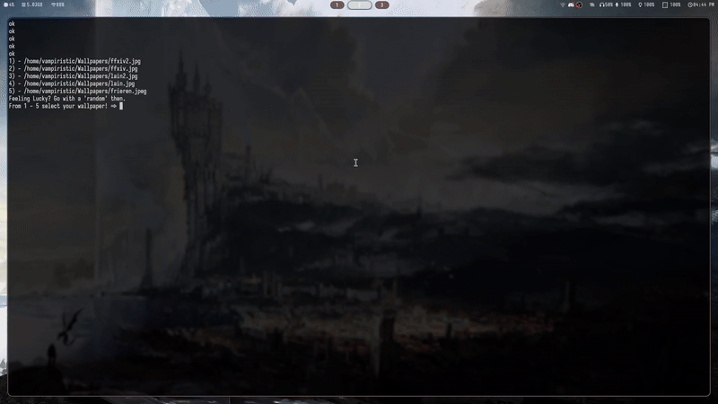

# HyprlandWallpaperChanger

    This is a small personal project that i use in a daily basis, a <em>amazing</em> <em>blazingly fast</em>... <strong>WALLPAPER CHANGER!</strong>

    I know, it's something <strong>never done before</strong>. 
    Anyway, as it says, it changes your wallpaper when you ask it to, pay attention to the usage of the program. 

## Program Usage

1. Pre-requesits 
    - Hyprpaper / Hyprland
    - Lua
    - Lua rocks
    - LFS (luafilesystem)
2. Setting your wallpapers
    1. On your home directory a.k.a "~/" create a directory called "Wallpapers".
    2. Throw your jpegs, jpg, whatever extention there.
3. Run! 
    - <code>lua src/wallpaperChanger.lua</code>

## Usage Example
 
